# Ma visite au Centre des Sciences de Montréal
Une exposition sur les différents aspects scientifiques

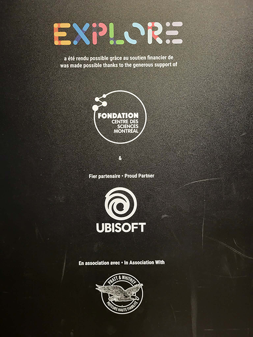

> Affiche de l'exposition *Explore* sur une structure métallique.

 

## Informations sur l'exposition
- **Nom de l'exposition:** Explore - La science en grand
- **Lieu:** Centre des Sciences de Montréal, 2 R. de la Commune O, Montréal (QC) H2Y 4B2
- **Type d'exposition:** Intérieur, permanent
- **Duré de l'exposition:** À l'année
- **Sujet de l'exposition:** L'exposition aide à la compréhension de plusieurs procédés scientifiques par la verbalisation et l'expérimentation diversifiante et éducative. (https://www.centredessciencesdemontreal.com, 2026)

 

## Le parcours de l'exposition *Explore*
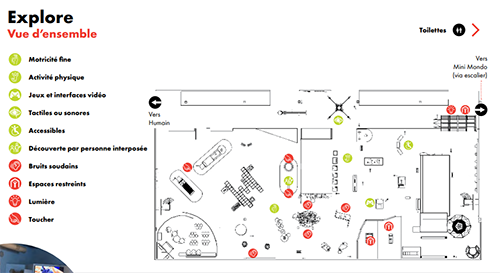

> Plan de l'exposition *Explore* vue d'en haut, image provenant d'un pdf fourni par le Centre des Sciences de Montréal pour les personnes avec des besoins particuliers

L'exposition se situe au deuxième étage de l'édifice. Le dispositif est situé en haut à droite du schéma. Il est l'un des deux accès visiteurs de l'exposition. *Explore* aborde plusieurs branches de la science, dont la lumière à laquelle le Kaléidoscope Géant en fait partie.

 

## Présentation du dispositif choisi

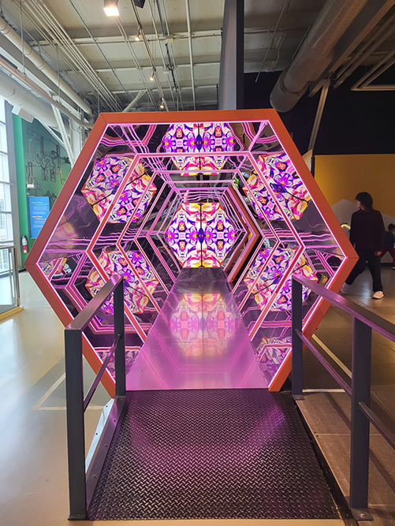 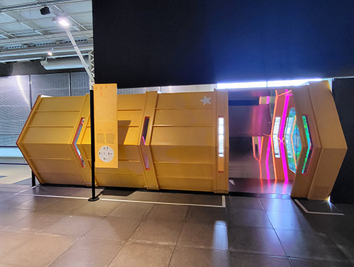

> Photographies vue de face et de côté du dispositif *Kaléidoscope Géant*

- **Dispositif:** Kaléidoscope Géant
- **Année:** 2017
- **Nom de la compagnie:** Moment Factory
- **Courte présentation de la compagnie et de son dispositif:** Le défi de la compagnie était de réussir à réinventer un classique *Science 26* qui est devenu *Explore*. Elle devait une vulgarisation des grandes thématiques de la science "de façon amusante et étonnante, mais surtout follement intuitive". (https://www.tknl.com) TKLN Expériences créer partout dans le monde et même en ligne. Pour ce projet, elle se s'est associé avec ACME DECORS qui "conçoit et réalise des décors pour l’industrie du spectacle et du divertissement, des installations pour les musées et des espaces commerciaux. Ses ateliers sont situés dans le Grand Montréal." (https://acmedecors.com)

> Photographie de l'installation du Kaléidoscope Géant fournit par le site du Musée des Sciences de Montréal

 

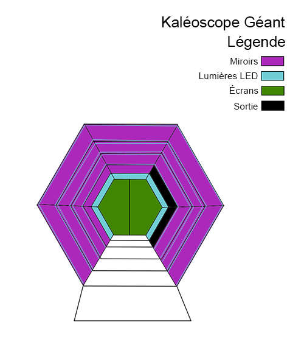

> Croquis de la mise en espace du dipositif *Kaléidoscope Géant* vue de face

- **Mise en espace:** La mise en espace du dispositif consiste en un structure hexogonal métallique de couleur jaune avec des miroirs, des bandes de lumières LED et deux écrans. Le visiteur peut accéder à l'exposition par le passage de ce kaléidoscopte Géant et en ressortir. Il introduit à la partie de l'exposition sur la lumière.

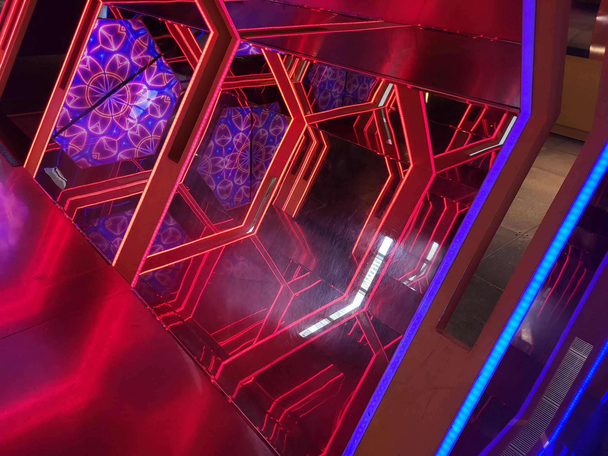 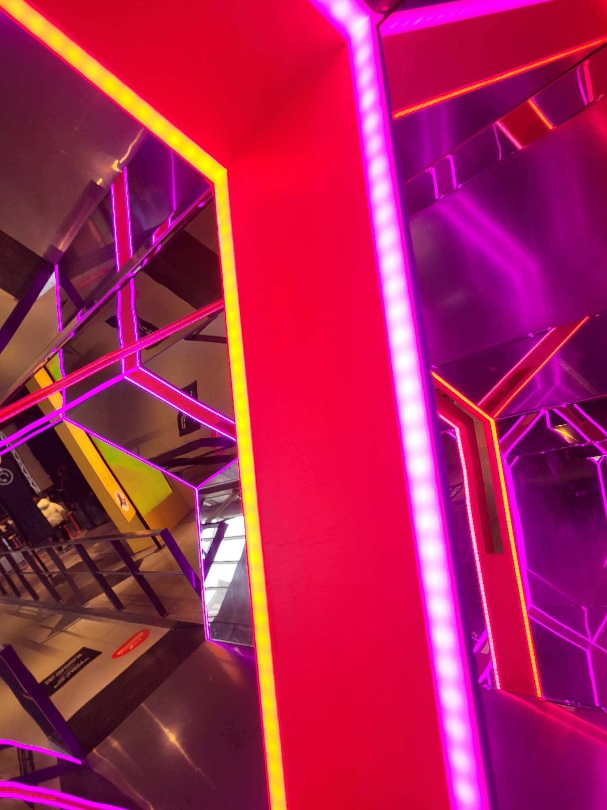 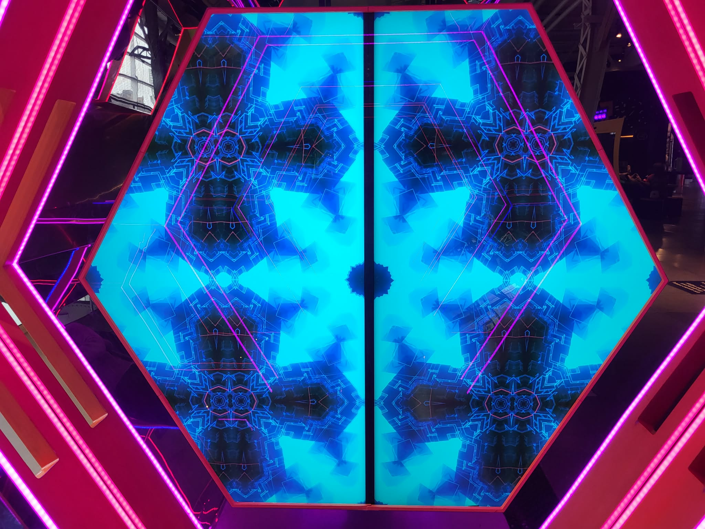

> Photographies des composantes techniques: les miroirs, les lumières et les écrans

**Composantes et techniques:**
- 23 miroirs
- 12 Bandes de lumières LED
- 2 écrans
- Câblages
- Structure métallique de forme hexogonal

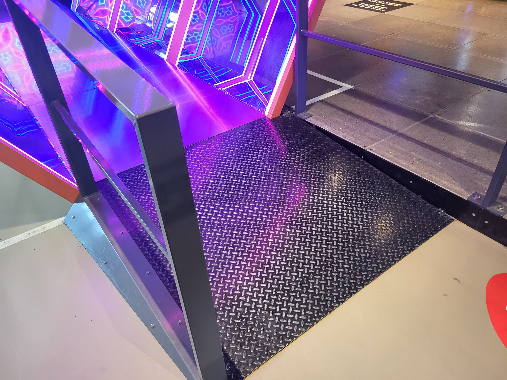 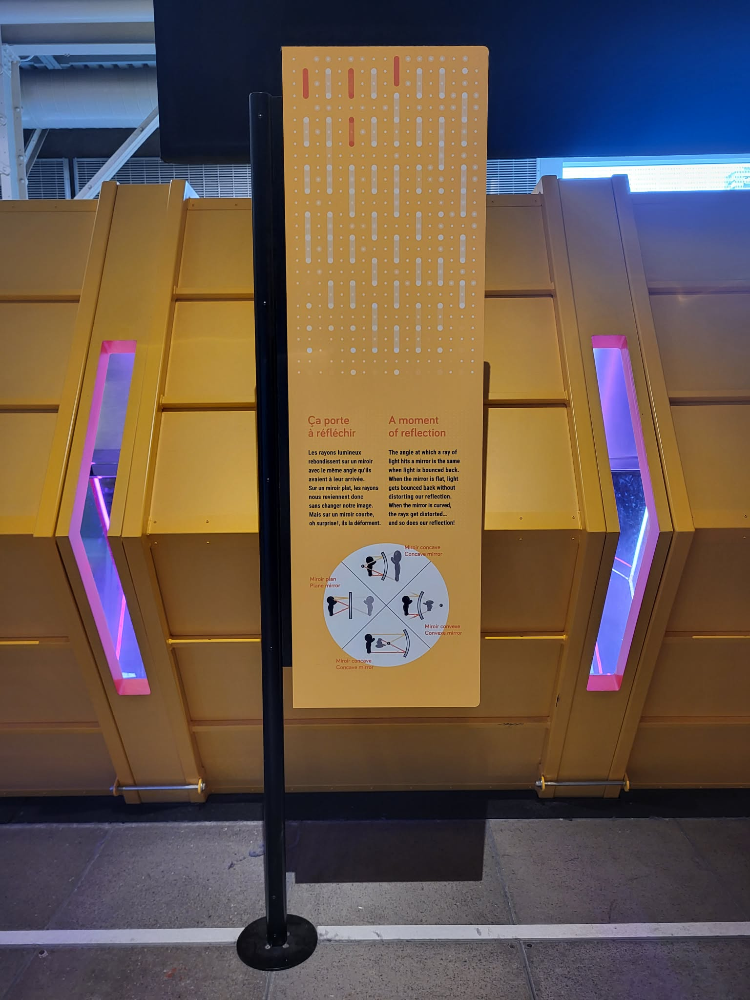

> Photographie de la passerelle et du support du texte explicatif

**Éléments nécessaires à la mise en exposition:** 
- Passerelle
- support métallique pour le texte explicatif

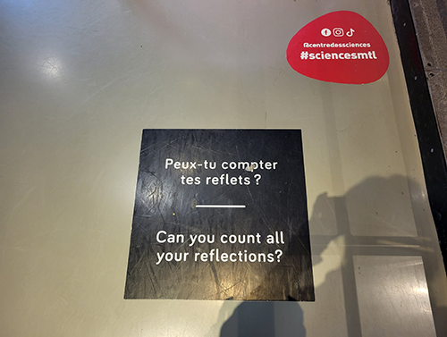 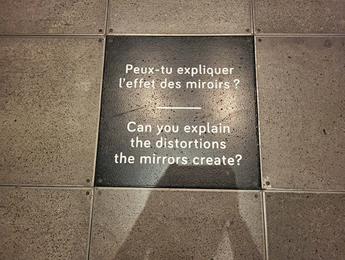 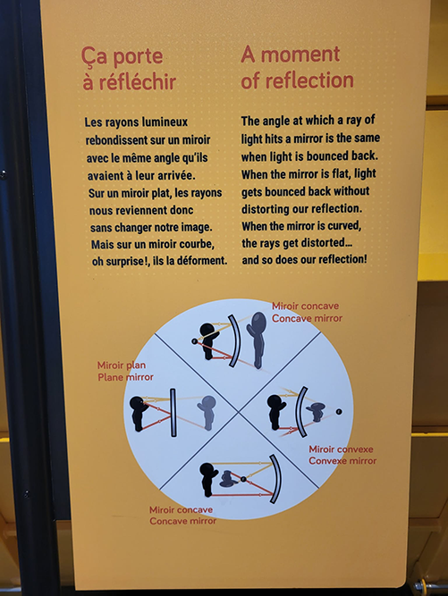

> Photopgrahies des pastilles et du texte explicatif du dispositif

 

## Mon expérience vécue

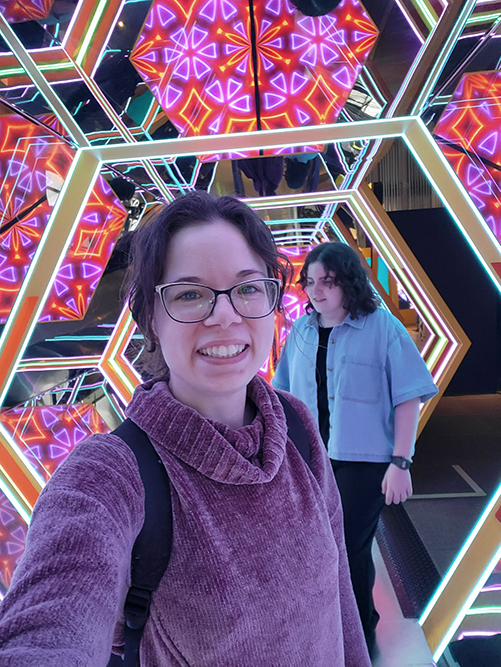

> Égo portrait de moi devant le Kaléidoscope Géant.

 

Cette exposition m'a inspiré une nostalgie et un nouveau souvenir. Je suis allée plus jeune et j'en avais eu de merveilleux souvenirs. J'ai aimé revisité des dispositifs qui m'avaient marqué et essayer les nouveaux. C'est d'ailleurs un des nouveaux que j'ai choisi comme dispositif à documenter. Le kaléoscope géant est un ajout aux miroirs déformants. Ils expliquent pourquoi notre reflet change dépendamment de la forme du miroir.

Je me suis sentie comme une enfant à nouveau quand je suis entrée à l'exposition par ce dispositif coloré et lumineux. Il reflétait mon image en haut, en bas et sur les côtés. J'avais 8 ans à nouveau, émerveillée et curieuse de tout expérimenter. Après avoir traversé le kaléoscope, je suis allée voir mon reflet déformé dans les différents miroirs. Mes amis riaient au élat et je pouvais sentir le sourire sur mes lèvres persisté toute la durée de la sortie. Je trouve que c'était une expérience efficace pour ouvrir l'esprit à vouloir apprendre et explorer. Le titre de l'exposition portait bien son nom.

 

- **Ce qui vous a plu, vous a donné des idées :** Ce qui m'a le plus plus est l'aspect géant. Je connaissais les kaléoscoptes, mais pouvoir se trouver à l'intérieur rendait l'expérience originale et marquante. Si j'ai à retenir une idée à propos du dispositif multimédia se serait de ne pas hésiter à aller chercher l'émerveillement autant chez les petits que les grands. Je m'inspirerais des jeux typiquement enfants pour les rendre adapté aux adultes. Une autre idée serait aussi de mélanger des phénomènes scientifiques pour agrémenter mes créations.
 
- **Aspect que vous ne souhaiteriez pas retenir pour vos propres créations ou que vous feriez autrement :** Je pense que si j'avais à faire ce dispositif, je ferais en sorte de mettre un petit texte d'explication à côté de chacun des miroirs déformants pour comprendre en quoi celui-ci est différent d'un autre. Pour le kaléoscope, spécifiquement, il aurait été intéressant d'avoir une vidéo explicative pourquoi mon image rebondissait partout. Pour mes créations, je retiens qu'il faut faire attention à la transmission de l'information. Il faut prendre le temps de répondre aux questions qui pourraient naître de l'expérience vécu.

 

**Références**  
https://www.tknl.com/projet-experiences/explore-la-science-en-grand-centre-des-sciences-de-montreal
https://www.centredessciencesdemontreal.com/exposition-permanente/explore
https://www.centredessciencesdemontreal.com/sites/default/files/inline-files/Matinees%20apaisees-guide%20accompagnement-fr.pdf
https://www.centredessciencesdemontreal.com/blogue/explore-reinventer-un-classique
https://acmedecors.com/portfolio_page/explore

Toutes les photographies sont prises par moi, excepté ce qui est indiqué contraire.
