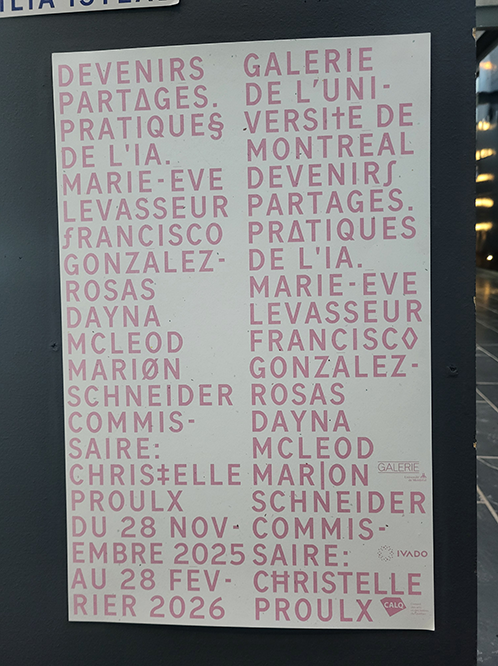
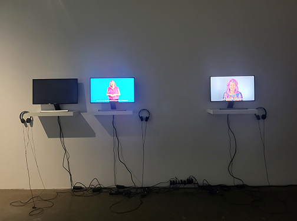
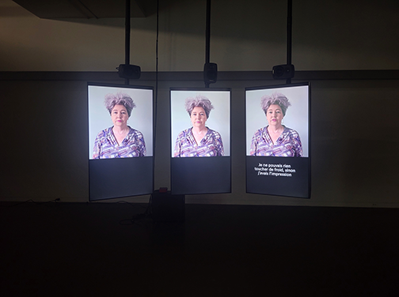
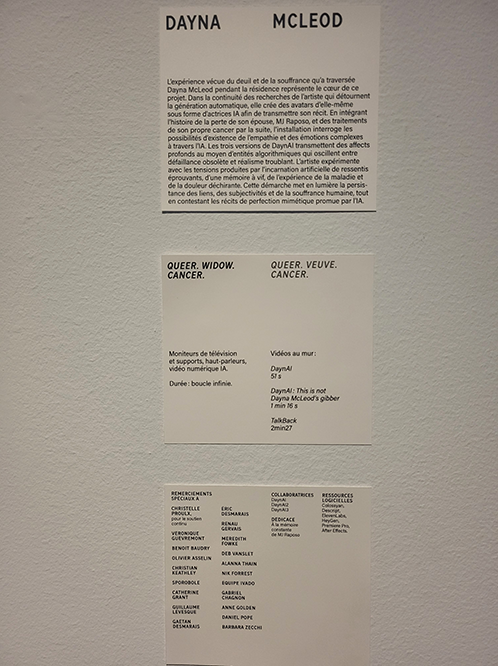
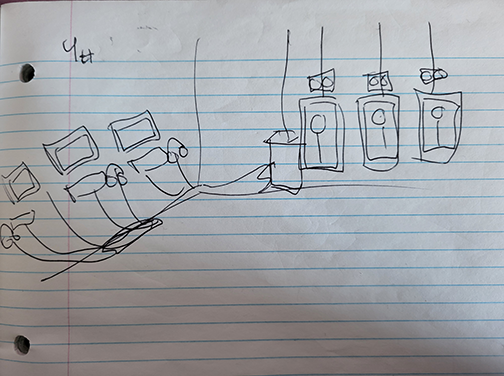
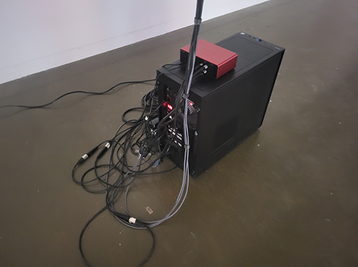
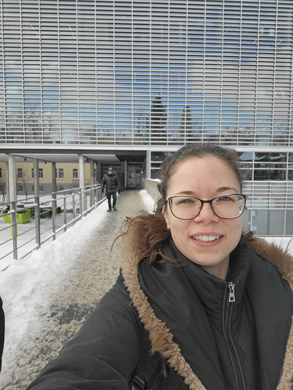

# Devenirs Partagés - Pratique de l'AI
Une exposition sur l'Ai en tant qu'outil et sujet.

## Présentation de l'endroit
- **Nom de l'exposition** : Devenirs Partagés - Pratique de l'AI
- **Lieu**: Galerie de l’Université de Montréal - 2940, ch. de la Côte-Sainte-Catherine, Pavillon de la Faculté de l’Aménagement, salle 0056 (niveau rez-de-jardin) Montréal (Qc) H3T 1B9
- **Type d'exposition** : Intérieur, temporaire
- **Duré de l'exposition** : Du 28 novembre 2025 au 28 février 2026

## Présentation de l'oeuvre choisie

- **Oeuvre**: QUEER-VEUVE-CANCER
- **Année**: 2025
- **Nom de l'artiste** : Dayna McLeod
- **Courte présentation de l'artiste et de son oeuvre**: Artiste queer d'âge mûr dans le domaine des médias et de la performance, Dayna McLoad vie depuis 20 ans à Montréal.
À travers trois avatars AI, elle raconte l'histoire de la perte de MJ, emportée par un cancer du pancréas en phase terminale, des soins qu'elle a reçu à domicile avec la communauté queer, et de mon diagnostic de cancer du côlon et du traitement de chimiothérapie que qu'elle a suivi après son décès." (Daynarama.com, 2026)

- **Mise en espace**: Au centre droit de la mise en espace se situe les trois principaux moniteurs légèrement tourné vers l'intérieur. Il y est joué une vidéo en boucle infini trois actrices AI représentant l'artiste et raccontant la même histoire trois fois. À la gauche, trois moniteurs avec écouteurs et supports concernant trois vidéos: DaynAI (51 s), DayAI:This is not Dayna McLeod's gibber (1 min 16 s) et TalkBack (2 min 27 s).

- **Composantes et techniques**: trois grands moniteurs de télévision et supports, trois petits moniteurs, trois hauts parleurs et vidéo numérique AI.
- **Éléments nécessaires à la mise en exposition**: Trois supports rattachés au système de soutient au plafond pour soutenir les trois grands moniteurs, trois petites étagères sous les trois petits moniteurs, trois écouteurs à la station des vidéos au mur, ordinateur, système de son, cable de connection avec les hauts parleurs et les écouteurs, prise d'alimentation.
- **Ressources logicielles à la réalisation de l'oeuvre**: Colossyan, Descript, ElevenLabs, HeyGen, Premiere Pro et After Effects.

## Mon expérience vécue

Je suis arrivée à l'exposition avec mes propres doutes, mes jugements et mes efforts à conserver un esprit neutre face au sujet. J'ai commencé mon parcours avec l'oeuvre près de l'entrer, à droite. Elle m'a permis de me détendre et d'embrasser l'utilisation de l'AI comme d'une expérimentation scientifique, sociologique et artistique. À cette instant, j'ai pu entrevoir une toute autre perspective à l'un des sujets les plus polymiques sur les réseaux sociaux. J'ai poursuivis avec la seconde oeuvre qui abordait un point de vue différent de la première, ce qui m'a mis en confiance que chacune des oeuvres présentes avec un but intéressant à réfléchir. J'ai même appris des choisis que je ne mettais jamais posé la question. À la troisième, j'ai rencontré un mur. Je reconnais davantage l'idée de l'AI que j'avais quand je suis rentrée dans la salle. C'était une oeuvre surchargé d'images et de sons qui cherchaient continuellement mon attention sans pour autant me donner quoi que ce soit d'autre qu'un fort sentiment de répulsion et de non-sens. Malgré tout, j'accorde à l'artiste la réussite de m'avoir fait ressentir ce mal-être de la société qu'il critiquait.

Malheureusement, ce parcours m'a mis dans un état qui ne me permettait pas d'accorder autant d'attention que je ne l'aurais souhaité à l'oeuvre choisie. Je me devais de l'écrire pour comprendre mon observation saccadé qui va suivre. Je me suis mise en retrait, quelque peu décalée des trois moniteurs. Mon attention éprouvée a survolé la première DaynAI. Un facial presque inerte mis à part les sourires déshumanisées du contexte, une bouche désinchronisée avec les paroles et un regard mort cherchant à être engageant. Mon cerveau avait fait le tour des informations qu'il avait de besoin en une fraction de secondes. L'audio devient alors plus important que le visuel. Je n'entendais pas très bien ce que la voix générée racontait, mais les sous-titre me permettaient de comprendre le témoignage. 

Quelques minutes plus tard, je versais des larmes d'une compassion que je ne m'attendais pas à ressentir. Sous mon regard, alternant entre les mots et les expressions de l'actrice AI, se construisait un lien. Ses expressions ne me paraissaient plus aussi inhumains ou désarticulés. Son sourire devenait l'un de ceux que l'on fait pour caché l'ampleur de notre peine. Ses gestes répétitif devenaient un moment d'inconfort dans les déclarations graves qu'elle faisait. Elle s'humanisait devant moi, alors que l'histoire alternait ma perception. Ou alors, est-ce moi, m'indentifiant à son discours, je cherchais à me connecter avec cette seule identitée qui me faisait face?  Il n'y avait aucune doute chez moi que je faisais le sujet d'une projection de mon vécu et quand retour je m'identifiais. Cet avatar AI était un masque de l'artiste tout simplement, donc je ne pouvais contourner pour l'atteindre. Résultat, ce masque devenait un mirroir qui reflétait mes émotions.

Qu'en était-il des autres avatars? Je ne suis restée qu'un instant devant le second avatar qui tentait de transmettre vainement le chagrin et la douleur. Les mains portées au coeur, la voix générée à partir de celle de Dyana McLoed qui pleurait durant la lecture de son texte et ses expressions peinées m'ont repoussé violemment. La première DaynAI ne forçait rien au spectateur. Elle racontait seulement et me laissait place à mes propres émotions et mes réflexions. La deuxième DaynAI me forçait à ressentir de la peine pour elle. Je ne m'indentifiais plus, le lien était coupé. Je suis allée visionnée les trois vidéos sur le côté gauche. J'ai aimé retrouvé cette première DaynAI et qui racontait les démarches de l'artiste. À la dernière station, j'ai fait vue pour la première fois la troisième DaynAI. L'artiste expliquait qu'elle voulait apporté aux deux autres un DaynAI plus mature et solanelle. Je lui accorde que j'étais de son avis, cet avatar était ce qu'il manquait à l'oeuvre. Cependant, lorsque je suis retournée aux trois moniteurs centrales, cette DaynAI m'a encore plus repoussé. Je l'avais trouvé parfait avec les deux autres durant les explications, pourtant toute seule à racconter la même histoire, je n'y voyais encore une fois pas de place pour m'identifier et me projeter.

- **Ce qui vous a plus, vous a donné des idées**: Ce qui m'a plu est principalement le questionnement de l'artiste si l'AI pouvait communiquer une émotion et véhiculé une partie difficile de son vécu. J'aimais comment elle encapsulait ce moment. Ces DaynAI resteraient figées alors qu'elle continuerait sa vie. Elles seraient le reflet d'une période de sa vie. Cette temporalité m'a beaucoup marqué. Un peu à l'idée d'une capsule temporelle, sauf qu'au lieu d'y mettre des objets, on y mettrait une partie émotionnelle de soi. Un journal intime animé en quelque sorte. Cet aspect nourrit ma créativité et mon désir de communiquer des perceptions, de raconter non seulement mon histoire, mais celles des autres. Un tout qui s'entrecroise et qui donne naissance à une vision que jusque là nous n'avions pas envisagé. Ça me rappel le projet que j'ai fait la session dernière en photographie, dont le sujet était mon père et son garage. J'avais ma propre perception de ce garage et il avait le sien. J'ai jumellé les deux et en assemblant le projet, j'ai vu sous mes yeux une vérité située entre nous deux. Je ne me rendais pas contre à ce moment que je venais de figer en image son histoire. On peut y voir mon amour pour lui, mon respect. On peut y avoir ses difficultés et ses passions. Je suis entrée dans son univers et j'ai pu exprimé cette amour qu'il pour ce garage surchargé qu'il n'arrivait pas à expliquer à son entourage.
- **Aspect que vous ne souhaiteriez pas retenir pour vos propres créations ou que vous feriez autrement**:L'artiste expliquait qu'elle ne voulait pas mettre les différents avatars côte à côte pour que le spectateur les compare uniquement dans leur tête et leur mémoire. Bien que j'approuve cette approche, j'ai trouvé qu'elle avait également une lacune. L'oeuvre devenait très redondante, puisque c'était la même histoire répétées trois fois. Snas compter que je venais de sortie d'une oeuvre qui m'avait exténué et rendait mon attention très courte. Je crois que je ferai attention à cet élément dans mes propres créations.

Références (identifier l'auteur.e des images et photos, inclure les hyperliens vers les sites consultés):
