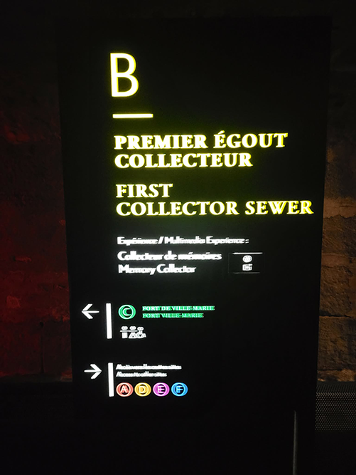
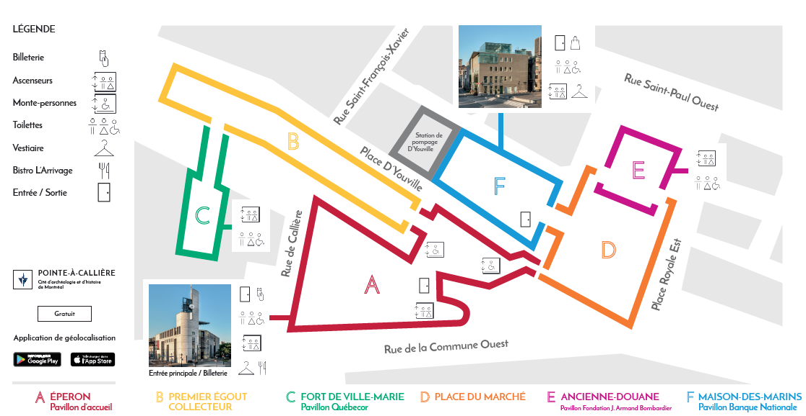
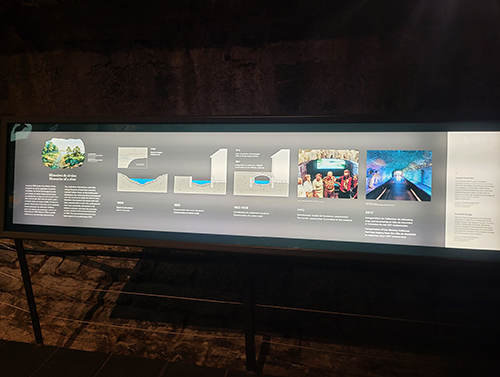
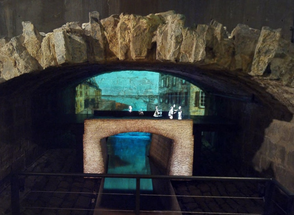
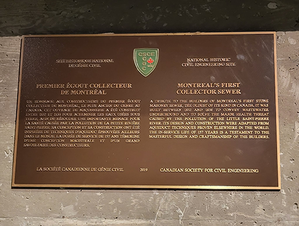
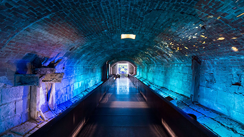
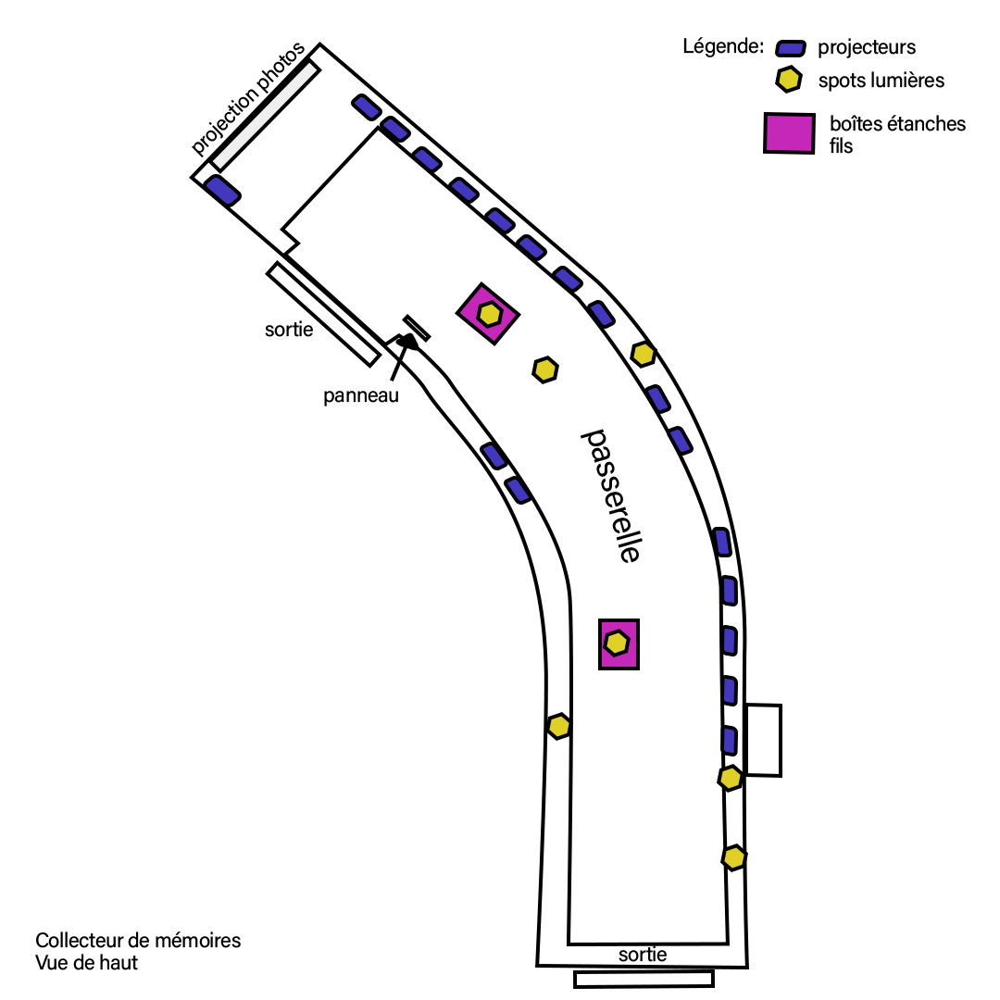
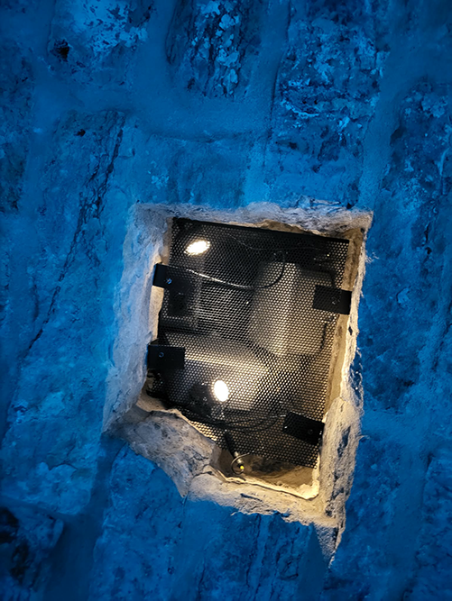
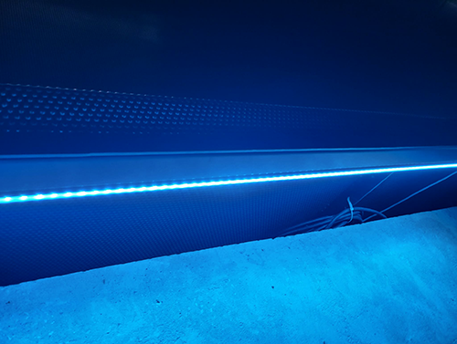
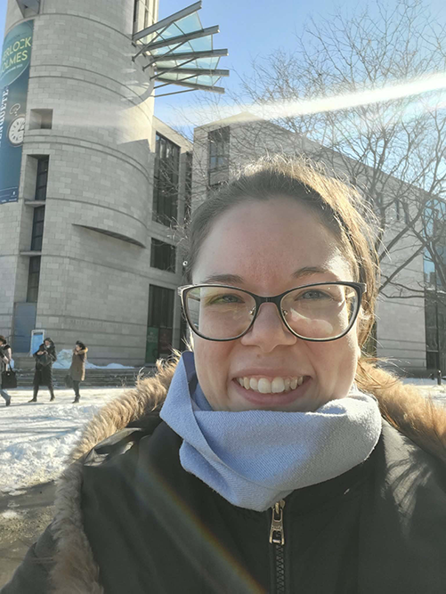

# Ma visite au musée Point-à-Callière
Une exposition sur le premier égoût collecteur de Montréal

> Panneau illuminé de l'exposition *Le premier égoût collecteur* à l'entrée du dispositif *Collecteur de mémoires*

 

## Informations sur l'exposition
- **Nom de l'exposition:** Premier égoût collecteur
- **Lieu:** Musée Pointe-à-Callière - 350 Pl. Royale (niveau rez-de-jardin) Montréal (QC) H2Y 3Y5
- **Type d'exposition:** Intérieur, permanent
- **Duré de l'exposition:** À l'année
- **Sujet de l'exposition:** L'exposition raconte l'histoire du premier égoût collecteur en Amérique du Nord, contruit à Montréal entre 1832 et 1838, et comment il a été réalisé. (https://pacmusee.qc.ca/, 2026)

 

## Le parcours de l'exposition *Premier égoût collecteur*

> Plan du musée vue d'en haut, image provenant d'un pdf fourni par le musée de Point-à-Callière

L'exposition se situe dans la partie B en jaune encadre l'entièreté de l'exposition *Premier égoût collecteur* de Montréal. L'exposition se divise en deux parties, l'une est informative et l'autre est une expérience immersive. En ce qui concerne la première, elle comporte un panneau illuminé horizontal explicatif à côté d'une animation projecté sur le mur opposé à l'entrée du dispositif. Il y a également une plaque commémorative en l'honneur de l'ingénerie civil csce.

> Texte explicatif sur l'histoire du premier égoût collecteur, passant de son idéalisation, à sa construction, à sa désaffectation, puis à son intégration au musée de Point-à-Callière.

> Projection vidéo de passants marchant au dessus du premier égoût collecteur.

> Plaque commémorative en l'honneur de l'ingénerie civil csce.

 

## Présentation du dispositif choisi

> Vue d'ensemble du dispositif *Collecteur de mémoires*, photographie par Stéphane Brügger

- **Dispositif:** Collecteur de mémoires
- **Année:** 2017
- **Nom de la compagnie:** Moment Factory
- **Courte présentation de la compagnie et de son dispositif:** Point-à-Callière a mandaté Moment Factory pour réalisé le disposition *Collecteur de mémoires*. Le but était de créer une expérience immersive qui permettrait de mettre en valeur l'ingénerie architectural de l'endroit sans pour autant que lea visiteura se sentent à l'étroit. L'inspiration de leur dispositif vient de l'eau, les saisons et l'histoire humaine des lieux. L'intégration << des images d’archives représentant la mémoire des Montréalais se transforment en particules de lumière qui ondoient le long des parois, comme bercées par les flots imaginaires de la Petite rivière. >> permettent de comprendre le lien entre les visiteurs et les gens du passé. (https://momentfactory.com/, 2026)

> Croquis de la mise en espace du dipositif *Collecteur de mémoires* vue de haut

- **Mise en espace:** La mise en espace du dispositif consiste à un tunel de 110 mètre de long avec des lumières leds de chaque côté de la passerelle métallique. ces lumières changent la couleurs des murs passant par le rouge, le rose, le turquois, le bleu et le violet.  Un projecteur affiche sur le mur du fond des photographies de la période de construction de l'égoût collecteur qui se "désintègrent" vers le bas comme de l'eau qui coule. Les autres projecteurs, à l'aide de projection maping, projectent une animation de particules multicolores qui s'éloignent vers l'avant du tunel dans une branche secondaire.

 

> Photographie des composantes techniques

**Composantes et techniques:**
- 18 projecteurs dans des boîtes étanches
- Entre 10-15 spot de lumières jaunâtres
- Bandes de lumières leds
- Câblages
- Boîtes étanges pour fils
  
**Éléments nécessaires à la mise en exposition:** 
- Passerelle

 

## Mon expérience vécue

> Égo portrait de moi devant le musée de la Point-à-Callière

À mon entrée dans l'exposition du Premier égoût collecteur, j'avais déjà cette impression solanelle d'être témoin du passé avec l'exposition précédante: Montréal au coeur des échanges. Bien que les anciennes structures précédentes étaient intéressantes, celles de l'égoût collecteur étaient impressionnantes. Elles n'avaient pas bouger sous les innondations de la terre ou brûlé par le feu, elles étaient intactent. Prendre conscience des informations avant de me rendre dans le Collecteur des mémoires m'a permis de me concentré sur l'expérience seulement et de consolider l'idée du rapport de proximité entre le passé et moi.

L'endroit paraissait grand et pourtant, je me sentais petite et un peu à l'étroit dans ce tunel remplit d'histoire. Je me trouvais jeune comparé à ce trésor historique. J'admirais les techniques employés par des gens de 1830-1840 pour construire quelque chose d'aussi solide pour contenir une petite rivière. Je n'ai pu m'empêcher de comparer ça à la qualité de la construction d'aujourd'hui. Il y a à réfléchir 

- **Ce qui vous a plu, vous a donné des idées :** 
 
- **Aspect que vous ne souhaiteriez pas retenir pour vos propres créations ou que vous feriez autrement :** 

**Références**
- Toutes les photographies ont été prises par Kellie Gravel exceptée celles indiquées en cas contraire.
- https://pacmusee.qc.ca/fr/expositions/detail/collecteur-de-memoires/ (consulté le 03 mars 2026)
- https://momentfactory.com/fr/products/collecteur-de-memoires (consulté le 03 mars 2026)
- https://erudit-montmorency.proxy.collecto.ca/fr/revues/cdd/2022-n76-cdd09281/1110909ar/ (consulté le 03 mars 2026)
- https://fr.wikipedia.org/ (consulté le 05 mars 2026)
