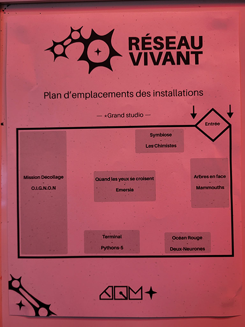
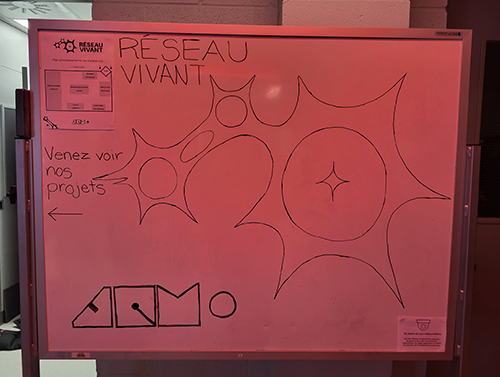
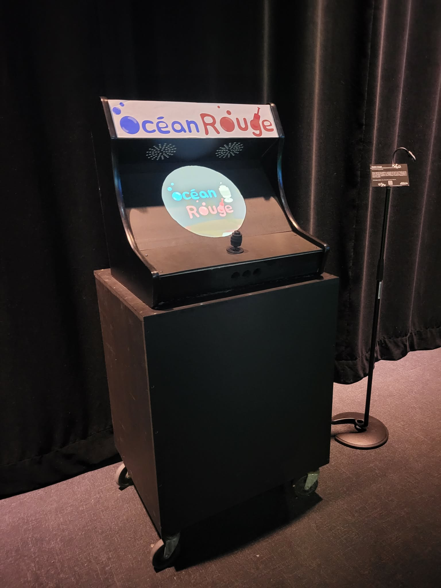
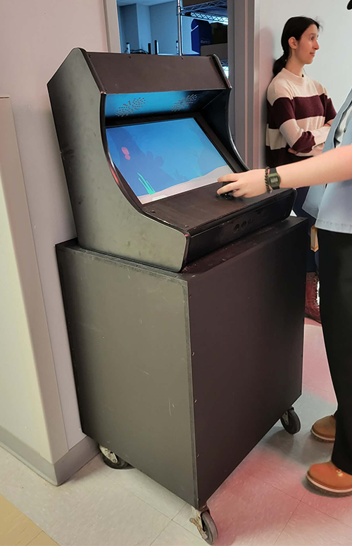
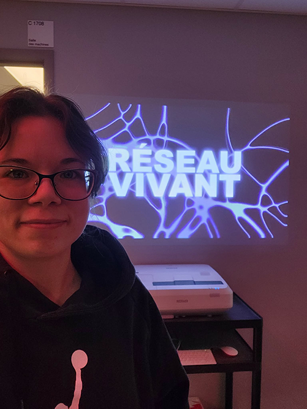

# Ma visite à l'expositon *Réseau Vivant*
Une exposition réalisée par les finissants de la technique d'intégration multimédia au collège Montmorency.

> Affiche de l'exposition sur la page d'évènement du collège Montmorency

 

## Informations sur l'exposition
- **Nom de l'exposition:** Réseau Vivant
- **Lieu:**  Collège Montmorency, Grand Studio C-1712 - 475, Boulevard de l'Avenir, Laval, QC H7N 5H9
- **Type d'exposition:** Intérieur, temporaire
- **Duré de l'exposition:** 16 - 20 mars 2026
- **Sujet de l'exposition:** L'exposition *Réseau Vivant* "explore la connectivité et les expériences partagées, se déployant comme une toile vivante tissée d'échanges, de gestes, de données et d'émotions." (https://tim-montmorency.com/2026/)

 

## Le parcours de l'exposition *Réseau Vivant*
 

> Plan du Grand studio vu d'en haut et de l'emplacement des oeuvres de l'exposition.

L'exposition se situe au local C-1712, au Grand studio, du collège Montmorency. De droite à gauche, nous avons *Arbre en face, Océan Rouge, Terminal, Mission décollage, Symbiose* et *Quand les yeux se croisent*. À la porte de l'exposition, il y avait une projection du nom de l'exposition et un tableau blanc avec un plan de la salle et les logo de la technique et de l'exposition.

 

## Présentation de l'oeuvre choisie

> Vue d'ensemble de l'oeuvre *Ocean Rouge*

- **Oeuvre:** Océan Rouge
- **Année:** 2025
- **Noms des artistes:** Amira Tounekti et Kristy Moussally
- **Courte présentation des artistes et du programme:**

 

 

> Croquis de la mise en espace de l'oeuvre *Océan Rouge* vue de biais

- **Mise en espace:** La mise en espace de l'oeuvre 

  

> Photographies des composantes techniques: un moniteur, une manette de jeu de type "joystick", un ordinateur, un clavier, une arcade et des câbles.

**Composantes et techniques:**
- Borne d'arcade en bois
- Manette de jeu "joystick" à bouton protentiomètre 4 axes
- Moniteur
- Ordinateur
- Clavier
- Câblages
- Arduino Nano
- Logiciel: Unity
  
**Éléments nécessaires à la mise en exposition:** 
- Support pour maintenir la cartel

 

## Mon expérience vécue

> Égo portrait de moi devant la projection de l'affiche de l'exposition Réseau Vivant

 

- **Ce qui vous a plu, vous a donné des idées :** C'était une belle expérience d"assister à l'exposition des finissants de mon programme. Je pouvais me projeter dans un avenir relativement proche et me demander, est-ce que c'est ce que je veux faire? Mon être fébrile d'excitation m'a confirmé que oui, j'étais à ma place dans ce environnement créatif. Je pouvais voir les oeuvres rejoindrent les gens comme j'ai toujours voulu faire de ma vie. Ce que j'ai le plus aimé de mon oeuvre choisi, *Océan Rouge*, c'est l'approche un peu plus intime de l'arcade contrairement aux autres jeux qui s'étendaient sur les murs. Le format individuel et petit pourrait porter à croire qu'il n'arriverait pas à faire connecter les gens et pourquoi je n'ai pas ressenti ça. Je me suis retrouvée à encourager mes amis à faire un bon score. Le temps de jeu permettait une rotation efficace des joueurs sans que l'un accapare tout le temps.J'ai aimé aussi la cohérence esthétique et le tutoriel du début. Les artistes ont su répondre à toutes mes questions et plus encore. J'ai énormément apprécié leurs interventions. Le tout m'a inspiré à me surpasser. J'ai toujours voulu faire un petit jeu et c'est pourquoi celui-ci m'a interpellé plus que les autres. Il me semblait plus proche de ce que je pouvais atteindre et du style que je désirais faire.
 
- **Aspect que vous ne souhaiteriez pas retenir pour vos propres créations ou que vous feriez autrement :** Malgré que j'ai aimé *Océan Rouge*, j'aurais porté un peu plus d'attention au visuel de l'acarde. J'aurai ajouté des détails comme des vagues, des poissons, des déchets et possiblement le titre du jeu pour le rendre un peu plus invitant. De plus, j'aurais apporté des décors l'entourant qui pourraient avoir une réaction au succès ou l'échec du joueur, afin d'augmenter l'immersion.

 

**Références**
https://www.cmontmorency.qc.ca (consulté le 25 avril 2026) 
https://tim-montmorency.com/2026/ (consulté le 25 avril 2026) 

À moins d'une mention contraire, toutes les photos ont été prise par moi.
