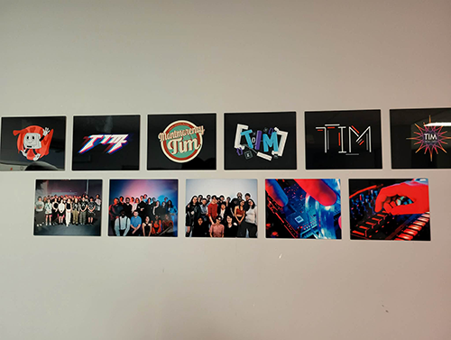

# Ma visite à l'expositon *Réseau Vivant*
Une exposition réalisée par les finissants de la technique d'intégration multimédia au collège Montmorency.

> Affiche de l'exposition sur la page d'évènement du collège Montmorency

 

## Informations sur l'exposition
- **Nom de l'exposition:** Réseau Vivant
- **Lieu:**  Collège Montmorency, Grand Studio C-1712 - 475, Boulevard de l'Avenir, Laval, QC H7N 5H9
- **Type d'exposition:** Intérieur, temporaire
- **Duré de l'exposition:** 16 - 20 mars 2026
- **Sujet de l'exposition:** L'exposition *Réseau Vivant* "explore la connectivité et les expériences partagées, se déployant comme une toile vivante tissée d'échanges, de gestes, de données et d'émotions." (https://tim-montmorency.com/2026/)

 

## Le parcours de l'exposition *Réseau Vivant*

> Plan du musée vue d'en haut, image provenant d'un pdf fourni par le musée de Pointe-à-Callière

L'exposition se situe dans la partie B en jaune encadrant l'entièreté de l'exposition Premier égout collecteur de Montréal. L'exposition se divise en deux parties, l'une est informative et l'autre est une expérience immersive. En ce qui concerne la première, elle comporte un panneau illuminé horizontal explicatif à côté d'une animation projetée sur le mur opposé à l'entrée du dispositif. Il y a également une plaque commémorative en l'honneur de l'ingénierie civile CSCE.

> Texte explicatif sur l'histoire du premier égout collecteur, passant de son idéalisation, à sa construction, à sa désaffectation, puis à son intégration au musée de Pointe-à-Callière.

> Projection vidéo de passants marchant au dessus du premier égout collecteur.

> Plaque comémorative du site historique nationnal de l'ingénerie civil.

 

## Présentation du dispositif choisi

> Vue d'ensemble du dispositif *Collecteur de mémoires*, photographie par Stéphane Brügger

- **Dispositif:** Collecteur de mémoires
- **Année:** 2017
- **Nom de la compagnie:** Moment Factory
- **Courte présentation de la compagnie et de son dispositif:** Pointe-à-Callière a mandaté Moment Factory pour réaliser le dispositif Collecteur de mémoires. Le but était de créer une expérience immersive qui permettrait de mettre en valeur l'ingénierie architecturale de l'endroit sans pour autant que les visiteurs se sentent à l'étroit. L'inspiration de leur dispositif vient de l'eau, des saisons et de l'histoire humaine des lieux. L'intégration << des images d’archives représentant la mémoire des Montréalais se transforment en particules de lumière qui ondoient le long des parois, comme bercées par les flots imaginaires de la Petite rivière. >> permet de comprendre le lien entre les visiteurs et les gens du passé. (https://momentfactory.com/, 2026)

 

> Croquis de la mise en espace du dipositif *Collecteur de mémoires* vue de haut

- **Mise en espace:** La mise en espace du dispositif consiste en un tunnel de 110 mètres de long avec des lumières LED de chaque côté de la passerelle métallique. Ces lumières changent la couleur des murs en passant par le rouge, le rose, le turquoise, le bleu et le violet. Un projecteur affiche sur le mur du fond des photographies de la période de construction de l'égout collecteur qui se "désintègrent" vers le bas comme de l'eau qui coule. Les autres projecteurs, à l'aide de projection mapping, projettent une animation de particules multicolores qui s'éloignent vers l'avant du tunnel dans une branche secondaire.

  

> Photographies des composantes techniques: une boîte étanche contenant un projecteur, un fil LED, une boîte étanches contenant des câbles éclairé par deux spots de lumière.

**Composantes et techniques:**
- Borne d'arcade en bois
- Manette de jeu "joystick" à bouton protentiomètre 4 axes
- Moniteur
- Ordinateur
- Clavier
- Câblages
- Arduino Nano
- Logiciel: Unity
  
**Éléments nécessaires à la mise en exposition:** 
- Support pour maintenir la cartel

 

## Mon expérience vécue

> Égo portrait de moi devant la projection de l'affiche de l'exposition Réseau Vivant

 

 

- **Ce qui vous a plu, vous a donné des idées :** 
 
- **Aspect que vous ne souhaiteriez pas retenir pour vos propres créations ou que vous feriez autrement :** 

 

**Références**
https://www.cmontmorency.qc.ca (consulté le 25 avril 2026) 
https://tim-montmorency.com/2026/ (consulté le 25 avril 2026) 
