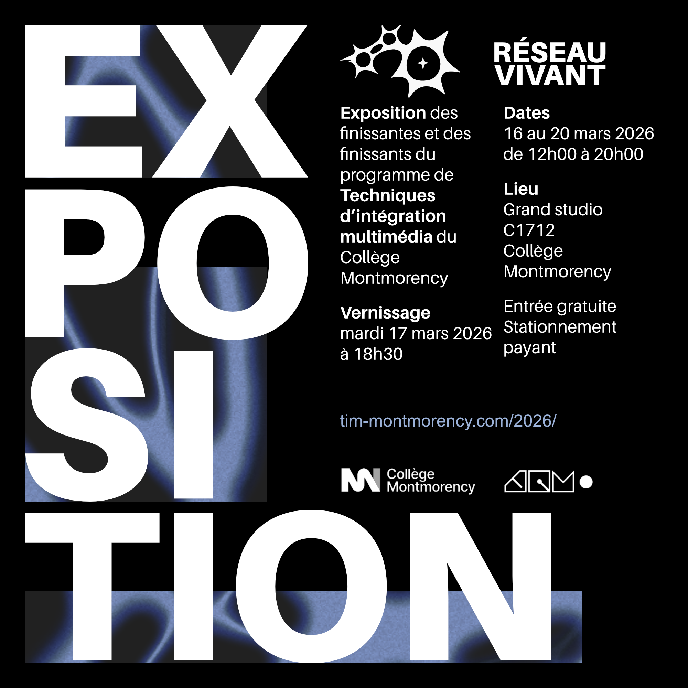
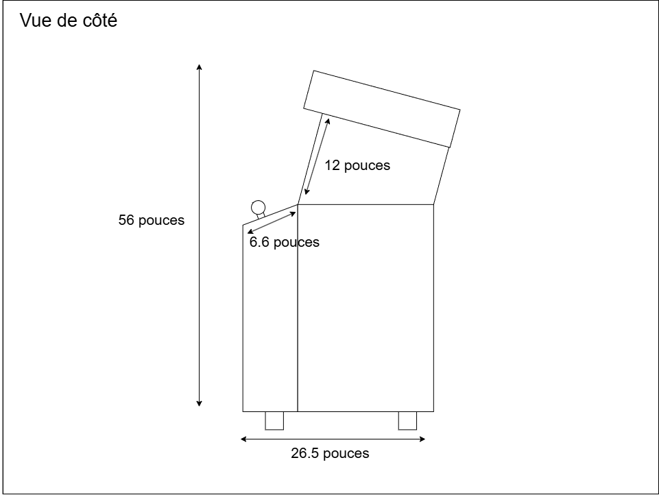
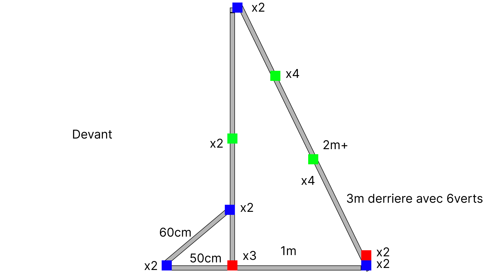
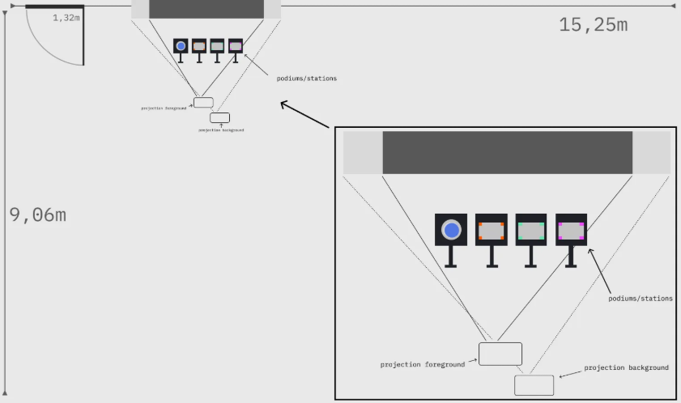

# Palmarès des oeuvres multimédias de l'exposition Réseau Vivant

## Critères personnels du palmarès
L'exposition "*explore la connectivité et les expériences partagées*", ce qui amène aux thèmes de l'échange autant intellectuel, émotionnelle et humaine. Je prends en compte non seulement l'exécution du projet de sa conceptualisation à sa concrétisation, mais également l'approche des artistes techniciens par rapport à leur oeuvre et envers le public. Puisqu'il s'agit d'une exposition ayant pour but de rendre vivant un réseau entre les oeuvres et les personnes impliquées. (tim-montmorency.com, 2026)

 

### 1. Océan Rouge

Photo d'ensemble
 

> *Photographie et schématisation faitent par les créatrices: Amira Tournekti et Kristy Moussally.*

**Ce que vous avez ressenti (avant/après) l'expérimentation:** *Océan Rouge* était une surprise quand je suis arrivée à ma première visite au moment où les étudiants étaient encore en développement de leurs oeuvres. Il y avait un autre projet annoncé à sa place, mais dû à des concours de circonstance, le projet a été remplacé. J'ai mis *Océan Rouge* à la première place de mon palmarès pour plusieurs raisons. J'ai aimé la simplicité du jeu et de ses mécanismes à chaque visite. Les images étaient harmonieuses. Bien que le jeu se faisait dans l'intimité, il n'empêchait pas les autres de venir regarder. Le temps de jeu était court, ce qui permettait que le joueur et le spectateur puisse alterné leur place sans impatience. Les artistes avient un désir de présenter leur jeu, de féliciter et de donner des astuces. Elles expliquaient leur processus avec enthousiasme et n'hésitaient pas à montrer des aspects techniques. Ce dernier commentaire est selon moi aussi important que l'oeuvre en elle-même, puis que l'exposition parlait d'un réseau vivant.

 De plus, en ce qui concerne ma banque d'inspiration, cette oeuvre me permet d'imaginer un peu mieux comment faire mes propres jeux, dont j'aimerais avoir une ambiance et une simplicité se rapprochant de la leur. L'ajout du didactitiel en début du jeu a beaucoup aidé l'expérience du jeu et la compréhension d'une nouvelle manette de jeu encore méconnue.

 

### 2. Mission décollage

Photo d'ensemble

> *Photographie et schématisation faitent par les créateurs: Ahmed Kaissoumi, Radhouane Kordan, Justin Montpetit, Thearylou Lach et Jad Saloumi.*

**Ce que vous avez ressenti (avant/après) l'expérimentation:** *Mission Décollage* n'était pas en deuxième place après ma première visite, mais l'oeuvre a su grimpé à chaque retour. Ma première impression me donnait l'impression d'être sudmergé. Intimidant, il y avait trop de consignes, de commandes. L'aspect en équipe me destabilisait. Il y avait aussi trop de monde lors de mes deux premières visites, ce n'est donc qu'à la troisième que je me suis lancée. J'ai été agréablement surprise que deux des créateurs présents étaient très investi dans l'accompagnement des joueurs et ponctuaient les avertissements du jeu avec les leurs pour aider à la compréhension des mécanismes. L'eouvre prend la deuxième place seulement parce que le jeu avait beaucoup d'instructions écrites qui étaient difficiles à suivre. Le visuel était immersif avec ses trois projecteurs.

 

### 3. Arbre-en-face

Photo d'ensemble

> *Photographie et schématisation faitent par les créateurs: Alexandre Gendron, Mikael Arseneau, Mathieu Willett, Matis Ghariani et Rafael Angon Dube.*

**Ce que vous avez ressenti (avant/après) l'expérimentation:** *Arbre-en-face* est une oeuvre qui m'a beaucoup plus pour son interractivité avec les autres. La toile et l'idée de voir son visage ou celui d'un proche donnait envie d'aller toucher l'oeuvre. Il ajoutait un aspect humoristique qui faisait éclore des rires de tant en tant dans la salle. J'ai apprécié l'amélioration de la qualité des images entre ma première et ma deuxième visite. Le partage d'une banque d'images entre l'oeuvre *Quand les yeux se croisent* et celle-ci a grandement aidé à ne pas rendre l'expérience répétitive. Cependant, bien que le changement fait pour faire pousser l'arbre où on voulait aidait avec l'immersion, elle contraignant la pousse des arbres qui étaient devenu plus difficile qu'à ma première visite. Pour les créateurs, leur implications avec le public était correcte, ils répondaient avec passion aux questions et aimaient raconté des annecdotes dans la conception du projet.

 

 ### 4. TERMINAL

Photo d'ensemble

> *Photographie et schématisation faitent par les créateurs: Émeryk Bélisle, Elie Daher, Ting Yung Lu Terry, Dana Saavedra-Torrano et Mégane Ranger.*

**Ce que vous avez ressenti (avant/après) l'expérimentation:** *Terminal* est une oeuvre que j'attendais avec impatience d'essayer, mais une fois aboutit, j'ai discerné des lacunes assez importantes. Techniquement, le jeu était très ambitieux et très bien exécuté, mais il y avait trop de niveaux, ce qui fait que la rotation des joueurs ne se faisaient pas efficacement. Il y a eu un cas en particulier où des personnes ne quittaient plus le jeu et beaucoup d'attentes se créaient. Il y a eu une intervention où les créateurs ont dû créer un bug pour faire partir les joueurs et laissaient par cette occasion d'autres personnes essayées lors de la soirée de vernissage. Je n'ai pu parlé qu'avec le principal créateur du jeu lors de la première visite, cependant je n'ai pu trouver aucun membre de l'équipe pendant le vernissage. Lorsque j'ai demandé à savoir où ils se trouvaient pour répondre aux questions techniques de la personne qui m'accompagnait, les professeurs ne pouvaient me montrer où ils se trouvaient. Le jeu était laissé à lui-même. J'ai trouvé cette partie décevante dans mon expérience, puisque je ressentais que l'oeuvre était plus la création d'une seule personne, plutôt que d'une fierté en équipe. Le partage entre les créateurs et les joueurs n'étaient pas présents contrairement aux autres.

 

### 5. Symbiose

Photo d'ensemble

> *Photographie et schématisation faitent par les créateurs: Créateurs: Yannick Chamberland, Benjamin Ferland, Ryan Dufault et Walid Cheour.*

**Ce que vous avez ressenti (avant/après) l'expérimentation:** *Symbiose* est une oeuvre qui a un concept intéressant selon moi, mais qui manquait un esthétique travaillé et clair. Lors de mon expérience, il n'y avait pas de tutoriel pour les mécanismes de jeu et le processus n'était pas facile à comprendre. Les consignes pour une manette pour un joueur se apparaissait à différent endroit, ce qui rendait difficile de suivre ce qu'on attendait de nous et si ça nous concernait. Il y avait également un décalibration entre l'action du joueur et l'effet à l'écran, ce qui compliquait la précision. Les créateurs n'étaient pas intéressés de nous accompagner dans le processus. Ils étaient impossible d'engager la conversation avec eux, puisqu'ils parlaient entre eux dans un coin en cercle.

 

### 6. Quand les yeux se croisent

Photo d'essemble

> *Photographie et schématisation faitent par les créateurs: Créateurs: Edelwyn Ledru, Félix Lavoie, Jade Hébert, Manel Yaya et Patricia Nassif.*

**Ce que vous avez ressenti (avant/après) l'expérimentation:** *Quand les yeux se croisent* est une oeuvre visuellement très belle. Contrairement au autre, elle demandait moins d'intérractivité. Elle servait plus un but contemplatif et réflectif. Malheureusement, cette oeuvre occupe la dernière place parce que la banque d'image des yeux accumulée des personnes ne s'affichaient pas toujours, occasionnant une déception chez le spectateur et l'ambiance sonore n'était pas audible lorsque l'endroit était achalandé. 

 

**Médiagraphie**
 
https://tim-montmorency.com/2026/ (consulté le 19 mars 2026)
