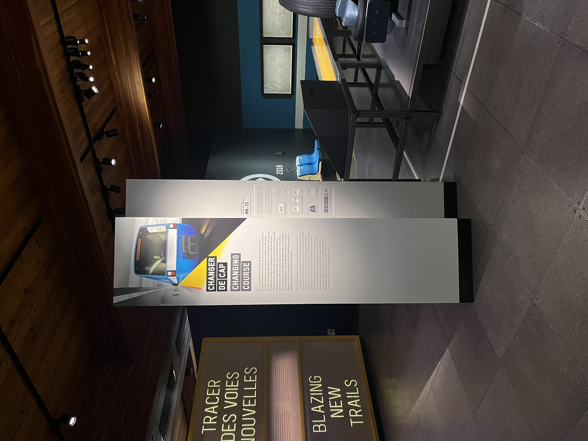

# Conférence avec Martin Boucher - un passionné dans son métier

Dans le cadre du cours d’œuvres et dispositifs multimédia, l’intervenant Martin Boucher, technicien au Musée de l'ingéniosité J. Armand Bombardier, est venu parlé de son métier et de ses tâches. Il se spécialise en ultra acoustique et motion design. Il a également travaillé au Musée des Beaux-Arts. La conférence s’est concentrée principalement sur deux dispositifs : le spectacle de bombardier et le bogie de métro MR-73.

Tout d’abord, la question : « C’est quoi le multimédia ?» a été posé et répondu en introduction à son métier. Martin Boucher a expliqué qu’être en multimédia c’était d’avoir ces connaissances suivantes : la gestion de projet, l’informatique, l’éclairage optique et DMX, l’audio mixage, la résolution de problèmes, l’électricité et constamment approfondir ses connaissances. Ensuite, il a parlé du spectacle de Bombardier qui raconte la vie de Joseph Bombardier et de ses inventions. L’intervenant a procédé à expliquer en quoi consistait son travail qui était de s’assurer que les diapositives, l’éclairage et la spatialisation du son fonctionnent correctement. Il expliquait les difficultés d’être un technicien en multimédia, c’est-à-dire savoir être « écono-producteur » comme il dit et ré-identifier ce que les autres ont fait avant nous.

Par après, l’intervenant nous a parlé de ce qui m’a inspiré le plus : son projet sur le bogie du métro. Le mandat était d’améliorer le temps d’accrocher davantage l’attention des visiteurs au bogie d’un ancien métro. Il a donc produit à l’aide des employés aux archives comme vulgarisé de l’information sur le fonctionnement du démarrage du métro et pourquoi nous entendons des notes avant son départ. Il a conçu un jeu avec des ressources fournis pour l’image de la marque. Le jeu permet aux visiteurs de comprendre comment l’hacheur de courant produisait ce son en retrouvant les bons Hertz pour former la mélodie.

  

>	Photographies de l’ensemble du dispositif, d’une vue plus rapproché de la console de jeu et du texte explicatif prisent par Sylvie François

Finalement, j’ai apprécié la conférence de Martin Boucher à cause de la passion qu’il avait dans ses propos. Le temps est passé vite et nous avions à peine eu le temps de se dégourdir de notre gêne. J’ai aimé voir concrètement le métier de technicien et de ses aptitudes à s’adapter au situation, au budget et au matériel, ce qui a été le cas pour le projet du bogie de métro. 

## Références  
Toutes les photographies ont été prise par Sylvie Françoise.
